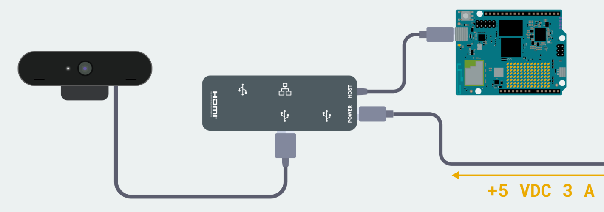
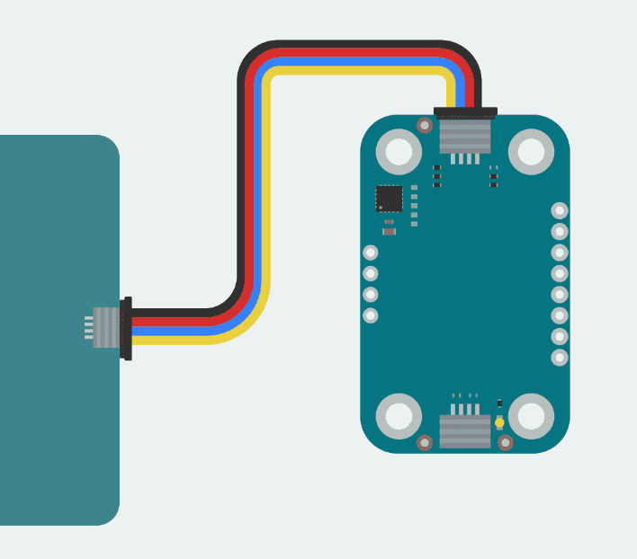
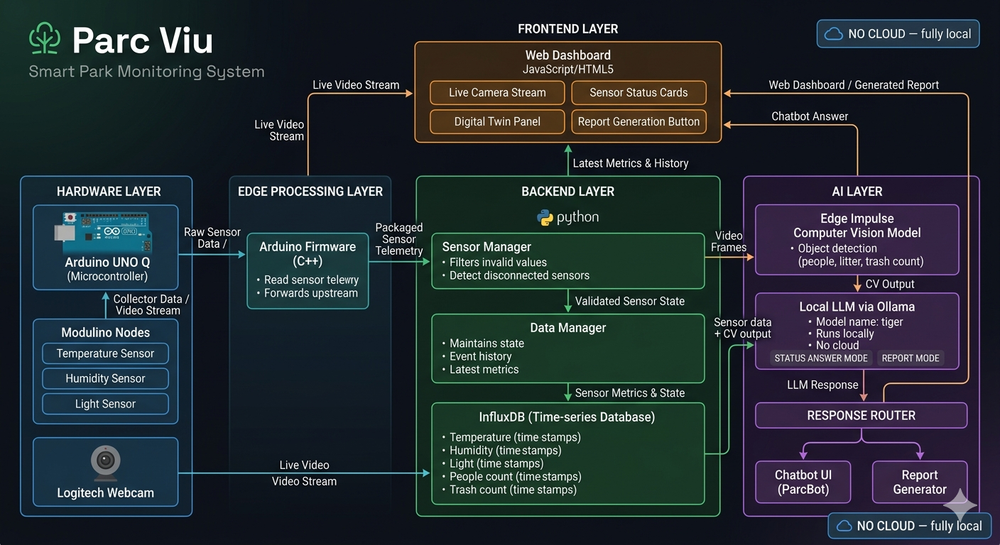
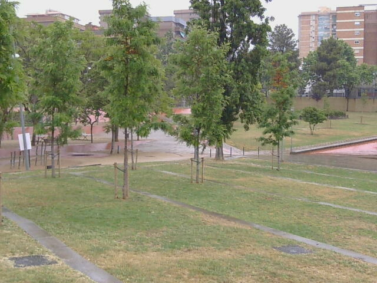
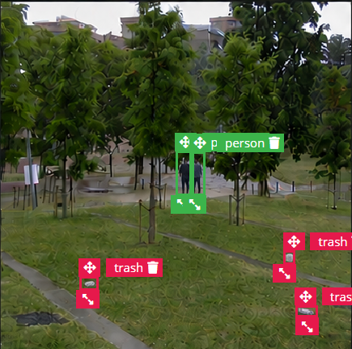

<a id="readme-top"></a>


<br />
<div align="center">
  <h3 align="center">5GTM-Interhack_BCN_2026</h3>

  <p align="center">
    An intelligent, edge-AI powered park monitoring system built for the 5GTM Interhack Barcelona 2026.
    <br />
    <a href="https://github.com/javierbellon01/5GTM-Interhack_BCN_2026.git"><strong>Explore the docs »</strong></a>
    <br />
    <br />
    <a href="https://github.com/javierbellon01/5GTM-Interhack_BCN_2026.git">Report Bug</a>
    ·
    <a href="https://github.com/javierbellon01/5GTM-Interhack_BCN_2026.git">Request Feature</a>
  </p>
</div>

<details>
  <summary>Table of Contents</summary>
  <ol>
    <li><a href="#materials">Materials</a></li>
    <li><a href="#how-to-install">How to Install</a></li>
    <li><a href="#problem-definition">Problem Definition</a></li>
    <li><a href="#constraints">Constraints</a></li>
    <li><a href="#our-proposal">Our Proposal</a></li>
    <li><a href="#model-architecture">Model Architecture</a></li>
    <li><a href="#perception">Perception</a></li>
    <li><a href="#edge-processing">Edge Processing</a></li>
    <li><a href="#python-backend">Python Backend</a></li>
    <li><a href="#llm-engine">LLM Engine</a></li>
    <li><a href="#response-router-local-llm--ui-sync">Response Router</a></li>
    <li><a href="#digital-twin">Digital Twin</a></li>
    <li><a href="#real-time-streaming-classification">Real Time Streaming Classification</a></li>
    <li><a href="#sensor-status">Sensor Status</a></li>
    <li><a href="#environmental-conditions-dashboards">Environmental Conditions</a></li>
    <li><a href="#image-acquisition">Image Acquisition</a></li>
    <li><a href="#synthetic-image-generation">Image Generation by AI</a></li>
    <li><a href="#ai-prompts">AI Prompts</a></li>
    <li><a href="#database">Database</a></li>
    <li><a href="#inside-arduino">Inside Arduino</a></li>
    <li><a href="#report">Report</a></li>
    <li><a href="#rules-llm">Definicion de Rules LLM</a></li>
    <li><a href="#container-isolation-networking-system">Container Isolation Networking System</a></li>
    <li><a href="#use-of-interface">Use of Interface</a></li>
    <li><a href="#built-with">Built With</a></li>
     <li><a href="#next-steps">Next Steps</a></li>
    <li><a href="#contact">Contact</a></li>
    <li><a href="#acknowledgments">Acknowledgments</a></li>
  </ol>
</details>

  ## Materials

  * Arduino UNO Q
  * Logitech webcam
  * Modulino temperature and light nodes
  * Computer for dashboard access and local LLM orchestration

  <p align="right">(<a href="#readme-top">back to top</a>)</p>

  ## How to Install

  Follow this order to get the full stack running in Arduino App Lab.

  ### 1. Clone the repository in Arduino App Lab

  1. Open Arduino App Lab.
  2. Open a terminal in the workspace and clone the repository:

  ```bash
  git clone https://github.com/javierbellon01/5GTM-Interhack_BCN_2026.git
  cd 5GTM-Interhack_BCN_2026
  ```

  3. Use the option to clone or import a repository if App Lab asks for it.
  4. Make sure the workspace contains the `app.yaml`, `python/`, `assets/` and `sketch/` folders.

  ### 2. Add the Edge Impulse model to Arduino App Lab

  1. Open the Edge Impulse deployment page:
    https://studio.edgeimpulse.com/studio/991247/impulse/1/deployment
  2. Export the deployment package for Arduino / App Lab compatibility.
  3. Add the generated model to the App Lab project as the object detection model.
  4. Confirm the model name matches the one referenced in `app.yaml`.

  ### 3. Install the local LLM runtime with Ollama

  1. Download and install Ollama.
  2. Open a terminal and start the server:

  ```bash
  OLLAMA_HOST=0.0.0.0 ollama serve &
  ```

  3. Create the model from the local `Modelfile`:

  ```bash
  ollama create tiger -f Modelfile
  ```

  4. Test the model:

  ```bash
  ollama run tiger
  ```

  5. Exit the interactive session with `Ctrl + D` when finished.

  ### 4. Mount the hardware

  Use the following physical layout for the park station.

  #### 4.1 Arduino UNO Q + webcam + hub

  Place the Arduino UNO Q and connect it to the USB hub and Logitech webcam as shown in the wiring diagram below.

  

  #### 4.2 Modulino sensor wiring

  Connect the Modulino sensor nodes to the UNO Q using the wiring image below and keep the bus stable during power-up.

  

  ### 5. Run the project

  1. Power the setup with the required external supply.
  2. Start the App Lab project.
  3. Open the dashboard and verify that the camera, sensors, and chatbot connect correctly.

## Problem Definition

Barcelona's parks have no voice. Parc Viu is a real-time monitoring system that gives awareness, personality, and its own voice to the Parc Central de Nou Barris.

The real problem is that Barcelona has many parks operating in the dark, without real-time monitoring. Incident detection, from vandalism to overflowing trash, still depends on citizens manually reporting problems. That reactive model delays maintenance and wastes public resources.

The gap is not only operational. Urban biodiversity is rarely tracked at park level, and local air, sunlight, humidity, and motion-related disturbances are not surfaced in a way that staff or citizens can act on quickly. Parc Viu turns a park into a live system that can be observed, queried, and interpreted.

<p align="right">(<a href="#readme-top">back to top</a>)</p>

## Constraints

The physical implementation is intentionally narrow so the platform stays reproducible.

1. The central processing unit is the Arduino UNO Q.
2. Visual monitoring uses a standard Logitech webcam.
3. Ambient sensing is limited to Modulino plug-and-play nodes for temperature and light, with the architecture ready to extend to motion data when available.
4. The app runs inside Arduino App Lab's isolated runtime, so network and dependency assumptions must be explicit.

<p align="right">(<a href="#readme-top">back to top</a>)</p>

## Our Proposal

The system combines a physical observer, a digital twin, and a local conversational layer. A device watches the park through computer vision and sensors, continuously tracking ambient conditions, people, and trash activity. That stream feeds a live dashboard and a digital twin that reflects the park moment by moment.

Citizens can talk to the park through ParcBot. The park can answer direct questions, complain about bad conditions, ask for maintenance, and generate reports when anomalies appear.

<p align="right">(<a href="#readme-top">back to top</a>)</p>

## Model Architecture

The architecture is split into acquisition, edge processing, backend analysis, and local response generation.



1. Perception captures webcam frames and sensor values.
2. Edge processing on the Arduino UNO Q normalizes and forwards telemetry.
3. The Python backend keeps state, histories, and sensor health.
4. The LLM engine formats answers and reports.
5. The response router synchronizes the local model with the UI.

This is a single-path pipeline with a strict goal: keep the park state visible, queryable, and easy to interpret.

<p align="right">(<a href="#readme-top">back to top</a>)</p>

## General Concepts

The architecture is split into acquisition, edge processing, backend analysis, and local response generation.

1. Perception captures webcam frames and sensor values.
2. Edge processing on the Arduino UNO Q normalizes and forwards telemetry.
3. The Python backend keeps state, histories, and sensor health.
4. The LLM engine formats answers and reports.
5. The response router synchronizes the local model with the UI.

This is a single-path pipeline with a strict goal: keep the park state visible, queryable, and easy to interpret.

### Edge Processing

The edge layer runs on the Arduino UNO Q. Its job is simple: read the connected devices, package the values, and send them upstream without mixing responsibilities.

### Python Backend

The Python backend is the stateful brain of the system. It normalizes sensor input, stores event history, handles stale or disconnected sensors, and exposes the aggregated view consumed by the UI.

#### Sensor Manager

The sensor manager filters invalid values, detects disconnected sensors, and keeps independent liveness state so one failure does not collapse the whole dashboard.

#### Data Manager

The data manager maintains state and event history. It keeps the latest metrics, tracks recent changes, and feeds the dashboard with the status of each source.

### Container Isolation Networking System

The LLM runs in a constrained execution environment, so networking matters.

The practical lesson is that local services inside isolated runtimes do not behave like ordinary desktop processes. `localhost` points to the container or sandbox itself, not necessarily to the host where Ollama is running.

The working setup uses a broader listen address for Ollama and keeps the application talking to that exposed service on the local network. In a production deployment, the better design would be an internal service network with a reverse proxy or service mesh, not an open host binding.

#### What the project learned

1. A container or App Lab runtime needs explicit network routing.
2. The LLM service must be reachable from the app's execution environment.
3. Production should use internal service discovery instead of ad hoc host exposure.

<p align="right">(<a href="#readme-top">back to top</a>)</p>

## AI, LLM and Image Recognition

### Perception

Perception is the front line of the system. The webcam handles object detection for litter and people, while the sensor layer captures ambient conditions. The concept can also extend to motion data from an MPU-style input if the hardware set is expanded later.

### Webcam Object Detection

The live camera stream is used for real-time classification and for building the digital twin view. The current implementation displays the stream inside the dashboard and supports object detection overlays from the edge model.

### Motion Data

The architecture leaves room for motion data as a separate signal when an MPU module is present. That input is useful for detecting physical disturbances, unusual activity, or park interactions that do not show up as visual events.

<p align="right">(<a href="#readme-top">back to top</a>)</p>

## Edge Processing

The edge layer runs on the Arduino UNO Q. Its job is simple: read the connected devices, package the values, and send them upstream without mixing responsibilities.

### Inside Arduino

The Arduino side is responsible for:

1. Reading temperature, humidity, and light.
2. Forwarding camera and sensor events.
3. Publishing samples through the bridge layer.
4. Keeping the hardware integration deterministic and low-latency.

The point of this layer is not intelligence. It is reliable acquisition.

<p align="right">(<a href="#readme-top">back to top</a>)</p>

## Python Backend

The Python backend is the stateful brain of the system. It normalizes sensor input, stores event history, handles stale or disconnected sensors, and exposes the aggregated view consumed by the UI.

### Sensor Manager

The sensor manager filters invalid values, detects disconnected sensors, and keeps independent liveness state so one failure does not collapse the whole dashboard.

### Data Manager

The data manager maintains state and event history. It keeps the latest metrics, tracks recent changes, and feeds the dashboard with the status of each source.

<p align="right">(<a href="#readme-top">back to top</a>)</p>

### Image Acquisition

#### Camera Point Used for Analysis

The model was trained and evaluated from a single fixed camera position. That is the same point of view used in the live deployment, so the network learns the exact geometry of the scene instead of trying to generalize to multiple angles.



#### One Focus

The dataset uses a single fixed point of view on purpose. For a static installation, specialization matters more than generalization. A camera that never moves should learn one scene deeply rather than many scenes weakly.

#### Process

1. A reference position is chosen inside the park.
2. The camera angle, lighting, and scene geometry are kept stable.
3. The same viewpoint becomes the anchor for training and deployment.

The tradeoff is clear: the model is not meant for arbitrary camera swaps without retraining, but it is very accurate for the installed position.

### Image Generation by AI

Synthetic image generation complements real photography. It helps expand the dataset without requiring endless manual collection and labeling.

The idea is to keep the background fixed and vary only the dynamic elements: litter, people, dogs, and occasional park objects. That teaches the model to pay attention to anomalies, not to scene noise.

#### Training Example

The synthetic training example below shows the kind of controlled image used to teach the detector what the park scene looks like when the relevant objects appear in front of the fixed background.



#### AI Prompts

The prompts are designed to preserve a consistent camera viewpoint, weather, and framing while altering only the foreground content. That makes the generated data realistic enough for training and controlled enough for repeatability.

### LLM Engine

The LLM engine dynamically changes its response style depending on what the user needs.

#### Status Answer Mode

When a person asks a direct question, the engine uses a prompt shaped like this:

```text
Based on this data: {data}. Answer this question: {question}. STATUS ANSWER MODE
```

In this mode, the model produces short, plain-language answers based on live park data.

#### Report Mode

When the system needs a summary, the engine switches to report generation:

```text
Based on this data: {data}. Generate the report. REPORT MODE
```

This mode prioritizes synthesis, incidents, anomalies, and maintenance notes.

### Response Router: Local LLM & UI Sync

The response router keeps the language model and the interface in step. It decides whether the output should become a chatbot reply, a report card, or a UI refresh. That separation keeps the system responsive and prevents the model from owning presentation logic.

### Digital Twin

The digital twin is the user-facing map of the park's current condition. It bundles live camera view, sensor state, report generation, and chatbot interaction into one coherent interface.

It is designed to answer four questions at a glance:

1. What is happening now?
2. What changed recently?
3. Which sensors are healthy?
4. What should maintenance staff do next?

### Real Time Streaming Classification

The live stream is not just passive video. It is a classification surface that feeds object counts and park state into the dashboard. That makes the stream useful both for humans and for the reporting pipeline.

### Sensor Status

Sensor health is exposed explicitly in the UI. When a sensor stops responding, the dashboard marks it as disconnected instead of freezing the last value. That makes failures visible and prevents false confidence in stale data.

### Environmental Conditions and Dashboards

The dashboard shows the current environmental context through live values and trend panels. Temperature, humidity, light, people, and trash counts are presented as operational signals, not isolated measurements.

This is the layer that turns raw telemetry into a situational picture.

### Database

Parc Viu produces a time series of sensor readings and events, so the backend needs a database that understands timestamps first.

InfluxDB fits that role because it is designed for measurements that arrive continuously. Each record stores values like temperature, humidity, light, people count, and trash count together with a timestamp.

The architecture keeps the database as the memory layer of the system: lightweight, time-based, and easy to query for trends.

### Report

The report output should cover three things:

1. Problems detected in the park.
2. Solutions or actions required.
3. Implementation limitations.

That keeps the report useful both for operators and for future iterations of the project.

### Definicion de Rules LLM

The local model follows two simple rules.

1. If the user asks a direct question, answer the question with live context.
2. If the system requests a summary, generate a structured report.

This keeps the assistant predictable and makes the output fit the UI instead of drifting into generic chat.

<p align="right">(<a href="#readme-top">back to top</a>)</p>

## Application

### Use of Interface

The interface is the operational surface for the project. It should be used to:

1. Monitor the live stream.
2. Check sensor health.
3. Ask ParcBot questions about the park.
4. Generate a report when maintenance needs a concise summary.

The goal is not to show everything everywhere. The goal is to surface the right information at the right time.

### Usage

1. Power on the Arduino UNO Q and ensure it connects to the local Wi-Fi network.
2. Open the App Lab project and start the runtime.
3. Run the local Ollama server if the chatbot needs LLM responses.
4. Open the web dashboard in your browser.
5. View the live camera stream, the sensor status cards, and the digital twin panels.
6. Use ParcBot ChatBot to query the current park status.
7. Generate a report when you need a summary of problems, solutions, and limitations.

### Built With

* JavaScript and HTML5 for the dashboard and interface.
* Edge Impulse for the computer vision model.
* Arduino C++ for the edge runtime and sensor bridge.

### Next Steps

1. Improve scalability for more park nodes and more environmental inputs.
2. Add richer incident categories for maintenance and reporting.
3. Extend the digital twin with more explicit historical charts and alert states.
4. Validate the full flow on hardware with the final camera position and sensor mounting.

<p align="right">(<a href="#readme-top">back to top</a>)</p>

## Contact

Contact any of the contributors for more information.

Project Link: [https://github.com/javierbellon01/5GTM-Interhack_BCN_2026.git](https://github.com/javierbellon01/5GTM-Interhack_BCN_2026.git)

<p align="right">(<a href="#readme-top">back to top</a>)</p>

## Acknowledgments

* [Edge Impulse](https://edgeimpulse.com/)
* [5GTM Interhack BCN](https://example.com)

<p align="right">(<a href="#readme-top">back to top</a>)</p>
